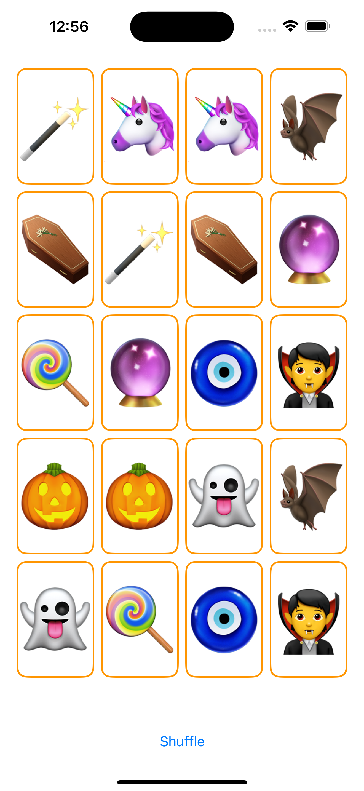
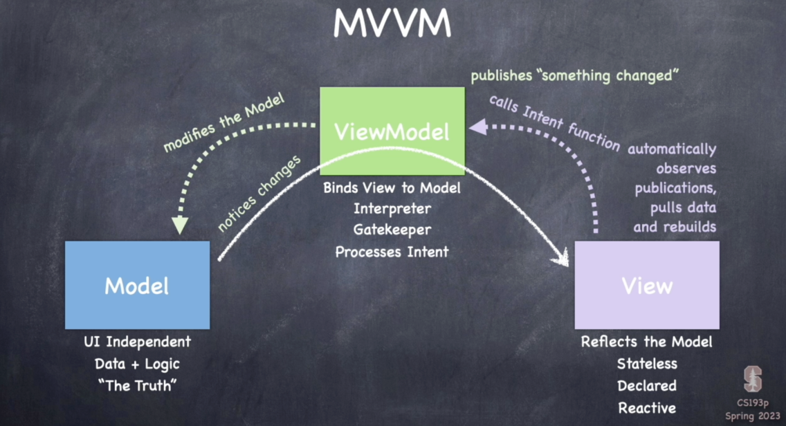

# Memorize

## 项目名称

Memorize | 记忆游戏

## MVVM 设计模式与 MVC 设计模式

### MVVM 设计模式（Model-View-ViewModel）

MVVM是由微软提出的架构模式，主要应用于WPF、Silverlight、Knockout.js、Vue.js等现代前端框架中。MVVM的目的是通过解耦视图（View）和业务逻辑（Model），使视图与业务逻辑保持独立，同时通过ViewModel作为中间桥梁，处理数据和业务逻辑的交互。

#### 组成部分

* **Model（模型）**：表示应用程序的核心数据和业务逻辑。Model通常是后端系统的映射，负责数据的获取、存储和处理。它不关心用户界面，也不依赖视图的变化。
* **View（视图）**：表示用户界面，负责展示数据。View直接与用户交互，是用户输入和输出的表现层。它通常是UI控件或界面模板，如HTML或XML。View只负责数据的显示，不处理业务逻辑。
* **ViewModel（视图模型）**：是连接Model和View的中介层。ViewModel负责处理Model的数据，转换成View所需要的格式，并将用户的交互（如输入）传递给Model。ViewModel通过数据绑定（data binding）机制与View保持同步，View上的数据变化自动反映在ViewModel中，ViewModel中的数据变化也会自动更新View。它不直接操作View，但通过绑定的方式影响View。

#### 特点

* **双向数据绑定**：View和ViewModel之间的数据是自动同步的，ViewModel的变化会实时反映在View上，反之亦然。这使得UI代码减少，逻辑清晰。
* **可测试性**：由于ViewModel不依赖于View，单元测试可以直接针对ViewModel进行，增强了应用的测试性。
* **解耦性高**：视图和模型之间的解耦程度较高，便于维护和扩展。

### MVC 设计模式（Model-View-Controller）

MVC是一种更早提出的设计模式，广泛用于Web开发中，如Django、Ruby on Rails、Spring MVC等框架。MVC旨在分离应用程序的关注点，通常用于处理用户交互、数据和UI分离的场景。

#### 组成部分

* **Model（模型）**：与MVVM中的Model类似，它负责处理应用程序的数据和业务逻辑，通常与数据库交互。Model包含核心数据，并处理数据的业务规则和状态。
* **View（视图）**：与MVVM的View类似，负责展示数据，响应用户输入。它通常是UI部分，负责将Model中的数据展示给用户，但不会包含复杂的业务逻辑。
* **Controller（控制器）**：作为Model和View之间的中介，负责接收用户输入并将其传递给Model处理，随后决定用哪个View来展示数据。Controller将用户的行为翻译为对Model的操作，并将Model的结果交给View展示。

#### 特点

* **单向数据流**：用户通过View与应用交互，交互数据传递给Controller，Controller根据需要更新Model，Model处理完成后通知Controller，Controller再选择适当的View更新界面。数据流动是单向的：View -> Controller -> Model -> View。
* **灵活性强**：Controller控制View和Model之间的交互，能够灵活地处理不同的用户输入和响应。
* **适合小型应用**：对于一些不需要复杂交互的应用，MVC模式足够简单且高效，易于实现。

### MVVM 与 MVC 的区别

#### 架构设计的侧重点

* **MVC**：Controller是用户与系统之间的中介。用户的操作首先被Controller捕捉，Controller决定如何处理这些操作，并将响应更新到View上。Controller在MVC模式中是核心组件，负责协调Model和View之间的交互。
* **MVVM**：ViewModel承担了数据管理的责任，直接与View绑定，不依赖Controller。View与ViewModel之间的双向数据绑定是MVVM的关键特性，ViewModel可以直接响应用户交互并更新View。

#### 数据流动方式

* **MVC**：MVC是单向数据流，用户操作View，View通过Controller调用Model，Model处理数据后，结果传递回Controller，Controller再指示View更新。
* **MVVM**：MVVM使用双向数据绑定，View和ViewModel之间的数据可以互相更新。View和ViewModel之间的关系是自动化的，减少了手动操作和逻辑控制。

#### 适用场景

* **MVC**：MVC适合用于传统的Web应用开发，特别是后端主导的应用程序。它在用户界面较为简单、用户交互逻辑不复杂时，表现较好。
* **MVVM**：MVVM适合用于需要频繁交互、数据绑定复杂的前端开发，如单页应用（SPA）、桌面应用等。Vue.js、Angular等框架通常使用MVVM模式来简化前端开发。

#### 复杂度

* **MVC**：MVC较为简单，适合小型应用，Controller的角色相对直接，处理逻辑清晰。
* **MVVM**：由于引入了ViewModel和数据绑定机制，MVVM相对复杂，尤其是在维护数据绑定时需要额外的注意。但对于复杂前端应用，它能显著减少手动操作。

#### 依赖关系

* **MVC**：View依赖Controller来获得数据更新，Controller依赖Model处理数据。Controller往往是耦合度最高的部分，因为它需要管理用户行为并协调View和Model。
* **MVVM**：View和ViewModel之间通过数据绑定保持同步，ViewModel可以独立于View存在，这让测试和维护更加方便。

## 项目 MVVM（Model-View-ViewModel）设计模式架构

Memorize 项目使用了 MVVM（Model-View-ViewModel）设计模式。以下是 M、V、VM 在项目中的具体代码对应，以及它们之间的逻辑关系：

### Model（模型）

Model 是负责处理数据和业务逻辑的部分，在项目中对应的是 `MemoryGame<CardContent>` 结构体（ `MemoryGame.swift` 文件）。它负责存储游戏卡片、处理游戏的基本逻辑（如卡片的内容生成、卡片的选择、洗牌等），并且只关心数据和逻辑，不与界面直接交互。

这里的 `MemoryGame` 处理了游戏卡片的生成和洗牌逻辑，`Card` 结构体表示每张卡片的状态（如是否正面朝上、是否匹配等）。

### View（视图）

View 是应用程序的用户界面，负责显示数据并与用户交互。在项目中，`EmojiMemoryGameView` 和 `CardView` 组件（ `EmojiMemoryGameView.swift` 文件）是 View，它们展示卡片的外观，并响应用户操作，比如点击卡片或按下“Shuffle”按钮。

`EmojiMemoryGameView` 显示了游戏的用户界面，并通过 `viewModel` 来获取数据（卡片信息）以及触发操作（洗牌）。`CardView` 是单张卡片的视图，负责展示卡片的外观（如显示Emoji或空白卡片）。

### ViewModel（视图模型）

ViewModel 负责处理视图与模型之间的交互，包含应用程序的状态和逻辑，它通过将数据从 Model 提供给 View，并处理用户输入操作。在项目中，`EmojiMemoryGame` 类（ `EmojiMemoryGame.swift` 文件）是 ViewModel，它连接了 `MemoryGame` 模型与 `EmojiMemoryGameView` 视图。

`EmojiMemoryGame` 中 `model` 是 MemoryGame 模型的实例，它负责初始化游戏逻辑，并通过 `@Published` 属性包装器来保证数据更新时，视图能够自动刷新显示。`cards` 属性提供给 View 需要显示的卡片信息，而 `shuffle` 和 `choose` 方法则用于处理用户操作，并与 Model 进行交互。

### M、V、VM 之间的逻辑关系

* View（ `EmojiMemoryGameView` 和 `CardView` ）显示数据，并通过用户操作（如点击“Shuffle”按钮或选择卡片）将指令传递给 ViewModel。
* ViewModel（ `EmojiMemoryGame` ）接收 View 的用户输入，并调用 Model（ `MemoryGame` ）进行业务逻辑处理，如洗牌、选择卡片等。ViewModel 通过 `@Published` 和 `@ObservedObject` 实现双向绑定，自动更新 View 显示最新数据。
* Model（ `MemoryGame` ）负责游戏的核心逻辑，如生成卡片、洗牌和卡片匹配逻辑。它处理所有与数据相关的操作，并将结果反馈给 ViewModel。

这种设计使得每一层都专注于各自的功能， View 只关心如何显示内容， ViewModel 负责业务逻辑，而 Model 负责数据管理。

## MVVM 设计模式工作流程

图片展示了 MVVM（Model-View-ViewModel）设计模式的工作流程，以下是对其中名词的解释：

* **Model**
  * **UI Independent**：模型与用户界面（UI）是独立的，意味着它不依赖UI的变化。无论UI如何改变，模型都应该只关心数据和业务逻辑。
  * **Data + Logic**：模型包含了数据和业务逻辑。它是应用程序的核心部分，负责处理数据存储、操作和业务规则。
  * **"The Truth"**：模型被视为数据的唯一来源，即所谓的“真理”。它负责维护应用程序的状态。
* **ViewModel**
  * **Binds View to Model**：ViewModel 的主要职责是将 View 和 Model 绑定在一起。它负责将 Model 中的数据转换成适合 View 展示的格式，并且可以响应 View 的操作。
  * **Interpreter**：ViewModel 充当了解释器，解释来自 View 的用户意图，并根据这些意图更新 Model 或采取相应的行动。
  * **Gatekeeper**：作为守门人，ViewModel 过滤用户的输入，将其转换成对 Model 的有效操作，确保操作的安全性和正确性。
  * **Processes Intent**：ViewModel 处理来自 View 的用户意图（Intent），这些意图可能是用户的交互，例如点击按钮或输入文本。ViewModel 将这些意图翻译成对 Model 的操作。
* **View**
  * **Automatically observes publications**：View 自动观察 ViewModel 发布的数据变化。这通常通过观察者模式或数据绑定机制实现，View 不需要主动询问数据变化，而是被动接收更新。
  * **Pulls data and rebuilds**：当 ViewModel 中的数据发生变化时，View 会自动拉取最新数据并重建 UI。这意味着 View 是响应式的，能够根据数据的变化自动更新显示内容。
  * **Reflects the Model**：View 直接反映 Model 中的数据，它展示了当前 Model 的状态，并与用户进行交互。
  * **Stateless**：View 被设计为无状态的，它不保存任何数据，只负责显示数据。这意味着它的状态完全由 ViewModel 决定。
  * **Declared**：View 是声明式的，意味着开发者只需声明界面布局和交互逻辑，框架会根据数据的变化自动更新 UI。声明式 UI 的一个例子就是 SwiftUI。
  * **Reactive**：View 是响应式的，它能根据 ViewModel 中数据的变化自动更新界面，减少了手动更新 UI 的复杂性。
* **逻辑关系**
  * **View 发布用户意图**：用户在 View 中执行操作，例如点击按钮或选择项，View 会将这些意图（操作）传递给 ViewModel。
  * **ViewModel 处理意图**：ViewModel 接收来自 View 的意图，并解释这些操作应该如何影响 Model。然后，它根据需要修改 Model。
  * **Model 通知 ViewModel**：当 Model 的数据或状态发生变化时，它会通知 ViewModel。
  * **ViewModel 发布数据变化**：ViewModel 将 Model 的变化发布给 View，告诉 View 需要更新界面。
  * **View 自动更新**：View 观察到 ViewModel 中的数据变化后，会自动拉取最新的数据，并重新渲染界面，确保显示的内容总是反映当前 Model 的状态。

这种设计模式通过双向数据绑定和响应式机制，简化了数据流和界面更新逻辑，同时保持了 View、ViewModel 和 Model 之间的解耦。

## 文档更新日期

2024年10月13日